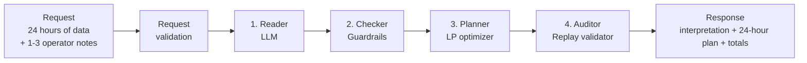
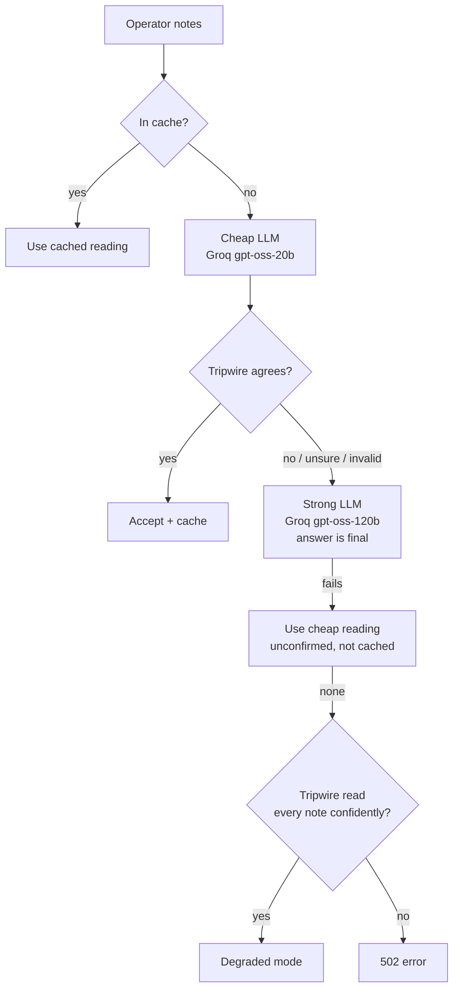

# GridWise

**An LLM-guided 24-hour campus energy planner.** It reads plain-English operator notes, turns them into strict, validated rules, and returns the cheapest grid, solar and battery schedule that obeys all of them.

BUP CSE Fest 2026 · GridWise preliminary.

**Contents:**
[Live endpoint](#live-endpoint) ·
[Architecture diagram](#architecture-diagram) ·
[How the solution works](#how-the-solution-works) ·
[Technology stack](#technology-stack) ·
[Supported directives](#supported-directives) ·
[Interpretation rules](#interpretation-rules) ·
[Environment variables](#environment-variables) ·
[Local quickstart](#local-quickstart) ·
[API usage](#api-usage) ·
[Public sample testing](#public-sample-testing) ·
[Testing strategy](#testing-strategy) ·
[Reliability / failure handling](#reliability--failure-handling) ·
[Docker](#docker) ·
[Project structure](#project-structure) ·
[Architectural decisions](#architectural-decisions) ·
[Security](#security) ·
[Performance](#performance) ·
[Known limitations](#known-limitations) ·
[Dependencies / credits](#dependencies--credits)

---

## Live endpoint

| | |
|---|---|
| Base URL | `https://gridwise-bup.fly.dev` |
| Health check | `GET https://gridwise-bup.fly.dev/health` → `{"status":"ok"}` |
| Optimizer | `POST https://gridwise-bup.fly.dev/optimize-energy` |
| Fly dashboard | <https://fly.io/apps/gridwise-bup> |
| Docker image | build locally from the [Dockerfile](Dockerfile) — see [Docker](#docker) below |
| Solution video | `<video-link>` *(3 min; script in [docs/VIDEO_GUIDE.md](docs/VIDEO_GUIDE.md))* |

No login, API key or VPN is needed to call the endpoint. It runs on Fly.io with at least one machine always on, so there are no cold starts.

---

## Architecture diagram



Inside the Reader, the steps are:



The full step-by-step pipeline:

```
POST /optimize-energy
   │
   ├─ 1. Request validation (Pydantic)            400 structural · 422 physically impossible
   ├─ 2. Interpretation (app/interpreter.py, app/llm.py)
   │      one batched LLM call for all notes → one "raw reading" per note
   │      cheap model ─► tripwire check ─agree─► accept · disagree ─► strong model (final)
   ├─ 3. Guardrail (app/directives.py): untrusted LLM output → validated Directive
   ├─ 4. Merge directives per hour: the most restrictive value wins
   ├─ 5. Optimizer (app/optimizer.py): two-stage linear program, 120 variables
   │      infeasible → re-ask strong LLM once → still infeasible → 422
   ├─ 6. Plan building: one battery action per hour, rounded to 4 decimals
   └─ 7. Replay (app/replay.py): independent re-check, totals recomputed from the plan
```

---

## How the solution works

Think of GridWise as a team of four, where each member has exactly one job.

1. **The Reader (an LLM)** reads the notes and says what each one means. It chooses one of the six allowed directives and names the hours and numbers involved.
2. **The Checker (plain code, no AI)** treats the LLM's answer as untrusted. It rejects anything outside the rules and does all the arithmetic itself.
3. **The Planner (a math solver)** finds the cheapest schedule. It buys grid power when it is cheap, stores it in the battery, and uses the battery when power is expensive, without ever breaking a rule.
4. **The Auditor (plain code)** replays the finished plan hour by hour, the way the judge does, and recomputes the totals. A plan that fails this check is never sent.

**Worked example.** The note is *"Expect an 80% reduction in rooftop solar between 11 AM and 2 PM."*

| Step | What happens |
|---|---|
| Reader | The LLM reports: type `solar_reduction`, span 11 → 14, value 80, meaning **reduction** |
| Checker | The end hour is excluded, so the hours are `[11, 12, 13]`. 80% less means 20% remains, so `factor = 0.2` |
| Planner | Solar in hours 11–13 is limited to 20% of the forecast, and the solver finds the cheapest plan |
| Auditor | Solar used ≤ 20% of forecast in those hours, energy balance holds every hour, and the battery ends where it started |

**How the cheapest plan is found.** The whole day is written as a *linear program*. It has five numbers per hour (grid, solar used, charge, discharge and battery level), 120 in total, plus equations and limits:

- **Energy balance** for every hour: `grid + solar_used + discharge = demand + charge`.
- **Battery level:** `level[h] = level[h-1] + charge[h] − discharge[h]`, which must stay between the reserve floor and the capacity.
- **Rate limits:** charge ≤ max charge, discharge ≤ max discharge.
- **Every directive:** solar factor, reserve, no-charge, no-discharge and grid caps.
- **Battery neutrality:** the level after hour 23 must equal the starting level.
- **Objective:** minimize `Σ grid[h] × tariff[h]`.

The HiGHS solver returns the proven minimum cost. A second pass keeps that cost fixed and picks the plan with the least battery back-and-forth, so the schedule is clean and never charges and discharges in the same hour.

---

## Technology stack

| Layer | Choice |
|---|---|
| Language | Python 3.11 |
| Web framework | FastAPI + Uvicorn |
| Validation | Pydantic v2 (strict types) |
| LLM, main | **Groq**: `openai/gpt-oss-20b` (first pass) and `openai/gpt-oss-120b` (escalation); `qwen/qwen3.8-27b` as a backup model |
| LLM, fallback | **OpenRouter**: `openai/gpt-4.1-mini` and `google/gemini-2.5-flash` (first pass); `anthropic/claude-sonnet-5` and `anthropic/claude-sonnet-4.6` (escalation) |
| LLM output | Strict JSON schema (`response_format: json_schema`), temperature 0 |
| Optimizer | Linear programming, SciPy `linprog` with the **HiGHS** solver |
| HTTP client | httpx (async) |
| Tests | pytest |
| Container / hosting | Docker (python:3.11-slim, non-root) · Fly.io (region `sin`) |

---

## Supported directives

Each note maps to exactly one of these six types.

| Directive | Meaning | `structured_adjustment` | `applies` |
|---|---|---|---|
| `solar_reduction` | Less solar is available in some hours | `{"hours": [...], "factor": 0–1}` | `true` |
| `minimum_battery_reserve` | Keep at least this much energy in the battery | `{"hours": [...], "minimum_energy_kwh": n}` | `true` |
| `no_charge_window` | The battery must not charge | `{"hours": [...]}` | `true` |
| `no_discharge_window` | The battery must not discharge | `{"hours": [...]}` | `true` |
| `max_grid_window` | Grid import is capped per hour | `{"hours": [...], "max_grid_kwh": n}` | `true` |
| `no_op` | The note doesn't affect today's plan (a distractor) | `null` | `false` |

How each directive is applied in the optimizer:

| Directive | Constraint for each listed hour `h` |
|---|---|
| `solar_reduction` | `solar_used[h] ≤ solar[h] × factor` |
| `minimum_battery_reserve` | `battery_energy_after[h] ≥ max(base minimum, minimum_energy_kwh)` |
| `no_charge_window` | `charge[h] = 0` |
| `no_discharge_window` | `discharge[h] = 0` |
| `max_grid_window` | `grid[h] ≤ max_grid_kwh` |

---

## Interpretation rules

| Rule | Example | Result |
|---|---|---|
| Windows include the start hour and exclude the end hour | "1 PM to 3 PM" | `[13, 14]` |
| 24-hour times | "18:00–21:00" | `[18, 19, 20]` |
| Noon and midnight | "from noon until 2 PM" | `[12, 13]` |
| Overnight windows wrap past midnight | "10 PM to 2 AM" | `[0, 1, 22, 23]` |
| Open-ended windows | "from 8 PM onwards" / "until 6 AM" | `[20..23]` / `[0..5]` |
| Times with minutes round outward | "until 3:30 PM" | includes hour 15 |
| Several periods in one note | "2–4 AM and 1–3 PM" | both ranges merged |
| `factor` is the share of solar that **remains** | "drops to 20%", "one-fifth of normal", "80% reduction" | `0.2` |
| Reserve as % of capacity is converted to kWh | "keep 50% of capacity", capacity 200 kWh | `100` |
| Other days or unrelated topics are distractors | "menu changes tomorrow", "meeting next week" | `no_op` |
| Overlapping notes: the strictest value wins | two solar notes, 0.5 and 0.2 | `0.2` (lowest factor, highest reserve, lowest cap; no-charge and no-discharge hours are combined) |

Every `hours` list is unique, sorted and within 0–23. There is exactly one interpretation per note, in the same order as `operator_notes`.

**Why the LLM doesn't do the arithmetic.** The LLM returns a *raw reading*: what the note literally says, such as span `{start_hour: 11, end_hour: 14}` and `{solar_value: 80, solar_meaning: "reduction"}`. Code then expands the hours and computes the factor. The two classic mistakes, an off-by-one window and "80% reduction" read as 0.8, are structurally valid, so a validator can't catch them. With this design they cannot happen, because the LLM never does that arithmetic.

---

## Environment variables

Only names are listed here. Never commit key values. `.env.example` has the full list.

| Variable | Required | Default | What it does |
|---|---|---|---|
| `GROQ_API_KEY` | **yes** (or an OpenRouter key) | – | Main LLM provider |
| `OPENROUTER_API_KEY` | no | – | Fallback LLM provider |
| `OPENAI_API_KEY` | no | – | Optional extra provider, used only if you add `openai:` to a chain |
| `LLM_CHEAP_CHAIN` | no | `groq:openai/gpt-oss-20b\|qwen/qwen3.8-27b,openrouter:openai/gpt-4.1-mini\|google/gemini-2.5-flash` | First-pass models, tried left to right. Format: `provider:model\|model,provider:model` |
| `LLM_STRONG_CHAIN` | no | `groq:openai/gpt-oss-120b\|openai/gpt-oss-20b,openrouter:anthropic/claude-sonnet-5\|anthropic/claude-sonnet-4.6` | Models used when a reading is escalated |
| `LLM_PROVIDER_COOLDOWN_S` | no | `300` | How long to skip a provider whose key is rejected (401/402/403) |
| `LLM_CHEAP_TIMEOUT_S` | no | `6` | Time limit for the first-pass call |
| `LLM_STRONG_TIMEOUT_S` | no | `10` | Time limit for the escalation call |
| `INTERPRET_DEADLINE_S` | no | `20` | Hard limit for the whole reading step (the judge timeout is 30 s) |
| `INTERPRET_CACHE_SIZE` | no | `1000` | How many confirmed note readings to keep in memory |
| `PORT` | no | `8080` | Listen port |
| `WEB_CONCURRENCY` | no | `2` | Server worker processes in the container |
| `LOG_LEVEL` | no | `INFO` | Each request logs its reading path (`cheap` / `strong` / `cache` / `degraded`), cost and time |

Changing provider or model is a **configuration change, not a code change**.

---

## Local quickstart

You need **Python 3.11+**, **git** and a **Groq API key** (free at <https://console.groq.com>). An OpenRouter key is optional.

**macOS / Linux**
```bash
git clone <repo-url> gridwise
cd gridwise
python3 -m venv .venv
source .venv/bin/activate
pip install -r requirements.txt
export GROQ_API_KEY=gsk_your_key_here
# optional fallback: export OPENROUTER_API_KEY=sk-or-your_key_here
uvicorn app.main:app --host 0.0.0.0 --port 8080
```

**Windows (PowerShell)**
```powershell
git clone <repo-url> gridwise
cd gridwise
python -m venv .venv
.venv\Scripts\Activate.ps1
pip install -r requirements.txt
$env:GROQ_API_KEY="gsk_your_key_here"
# optional fallback: $env:OPENROUTER_API_KEY="sk-or-your_key_here"
uvicorn app.main:app --host 0.0.0.0 --port 8080
```

Then, in a **second terminal** in the same folder:

```bash
curl http://127.0.0.1:8080/health
```
Expected: `{"status":"ok"}`

```bash
curl -X POST http://127.0.0.1:8080/optimize-energy -H "Content-Type: application/json" -d @samples/official/requests/SAMPLE-01.json
```
Expected: a JSON response with `directive_interpretation`, a 24-entry `hourly_plan` and `"total_cost_bdt": 38365.0`.

On Windows PowerShell, type `curl.exe` instead of `curl`, and use `127.0.0.1` rather than `localhost`, which avoids a slow IPv6 lookup.

---

## API usage

### `GET /health`
```bash
curl https://gridwise-bup.fly.dev/health
```
```json
{"status": "ok"}
```

### `POST /optimize-energy`

**Request** (`samples/official/requests/SAMPLE-01.json`, with the hours shortened here):
```json
{
  "scenario_id": "SAMPLE-01",
  "operator_notes": [
    "Facilities will wash the rooftop solar panels from noon until 2 PM. During cleaning, usable solar should be treated as roughly 25% of the forecast.",
    "The sports office moved next month's registration deadline."
  ],
  "hours": [
    { "hour": 0, "demand_kwh": 90, "solar_kwh": 0, "tariff_bdt_per_kwh": 6 },
    "... exactly 24 entries, hours 0 to 23 ..."
  ],
  "battery": {
    "capacity_kwh": 220, "initial_energy_kwh": 110, "minimum_energy_kwh": 40,
    "max_charge_kwh_per_hour": 50, "max_discharge_kwh_per_hour": 50
  }
}
```

**Response** (real output, with `hourly_plan` shortened to hours 11–14):
```json
{
  "scenario_id": "SAMPLE-01",
  "directive_interpretation": [
    {
      "note_index": 0,
      "applies": true,
      "directive_type": "solar_reduction",
      "structured_adjustment": { "hours": [12, 13], "factor": 0.25 },
      "explanation": "Usable solar limited to 0.25x of forecast during 12:00-14:00. Reading: Solar panels are being washed, so available output is about 25% of forecast during that period."
    },
    {
      "note_index": 1,
      "applies": false,
      "directive_type": "no_op",
      "structured_adjustment": null,
      "explanation": "Does not affect today's energy schedule; no constraint applied. Reading: The note refers to a future registration deadline and does not affect today's energy schedule."
    }
  ],
  "hourly_plan": [
    { "hour": 11, "grid_kwh": 0.0,   "solar_used_kwh": 160.0, "battery_action": "discharge", "battery_kwh": 20.0, "battery_energy_after_kwh": 155.0 },
    { "hour": 12, "grid_kwh": 90.0,  "solar_used_kwh": 45.0,  "battery_action": "discharge", "battery_kwh": 50.0, "battery_energy_after_kwh": 105.0 },
    { "hour": 13, "grid_kwh": 152.5, "solar_used_kwh": 42.5,  "battery_action": "charge",    "battery_kwh": 15.0, "battery_energy_after_kwh": 120.0 },
    { "hour": 14, "grid_kwh": 80.0,  "solar_used_kwh": 140.0, "battery_action": "charge",    "battery_kwh": 50.0, "battery_energy_after_kwh": 170.0 }
  ],
  "total_grid_kwh": 2692.5,
  "total_cost_bdt": 38365.0,
  "peak_grid_kwh": 175.0,
  "plan_summary": "Cost-optimal plan (linear program) applying 1 operator directive(s) and ignoring 1 irrelevant note(s). Charges 335.00 kWh during 02:00-05:00, 13:00-16:00, 22:00-00:00. Discharges 335.00 kWh during 01:00-02:00, 10:00-13:00, 17:00-21:00. Grid import 2692.50 kWh (peak 175.00 kWh), cost 38365.00 BDT; battery ends at its starting level."
}
```

What this example shows:
- "noon until 2 PM" became hours `[12, 13]`, because the end hour is excluded.
- "roughly 25% of the forecast" became `factor 0.25`, the share of solar that remains.
- The unrelated sports-office note became a distractor (`no_op`).
- `battery_kwh` is always a positive amount; its direction is given by `battery_action` (`charge`, `discharge` or `idle`).
- The cost is exactly the reference optimum.

### Status codes

| Status | When |
|---|---|
| 200 | Success |
| 400 | Broken JSON, missing or wrong-typed fields, not exactly 24 unique hours 0–23, 0 or more than 3 notes, blank note, blank `scenario_id`, negative tariff |
| 422 | Valid JSON that is physically impossible (for example, the starting level is outside the battery limits), or no plan can satisfy the notes even after a second reading |
| 502 | The language model is unavailable and the notes couldn't be read safely |
| 500 | Controlled internal error |

Error bodies look like `{"error": "<code>", "message": "<safe text>"}`. Hours sent out of order are sorted, and unknown extra fields are ignored.

---

## Public sample testing

The official pack is `samples/official/public_sample_cases.json`. For direct `curl` use, each request is also saved separately as `samples/official/requests/SAMPLE-01.json` … `SAMPLE-10.json`.

With the service running:

```bash
python scripts/run_samples.py http://127.0.0.1:8080 samples/official
```

For every sample, the script checks three things:
1. The **interpretation** matches the expected directive type, hours and values.
2. The returned plan passes an **independent replay** of every rule.
3. The **cost** is within 0.01 BDT of the reference optimum.

It accepts equivalent optimal schedules, as the official rules allow.

**Current result:** `10/10 samples passed` with Groq, each at the exact reference cost. The slowest request took 0.84 s.

Also verified directly against the live deployment (<https://gridwise-bup.fly.dev>): all 10 official samples returned `HTTP 200` with valid plans (e.g. SAMPLE-02 → `total_cost_bdt: 42885.0`).

| Sample | What it tests | Result |
|---|---|---|
| 01 | Solar cleaning + distractor | ✅ |
| 02 | Battery charging maintenance (no-charge) | ✅ |
| 03 | Reserve as % of capacity | ✅ |
| 04 | No-discharge in an expensive period | ✅ |
| 05 | Temporary grid cap | ✅ |
| 06 | Multiple notes + distractor | ✅ |
| 07 | Reserve + grid cap | ✅ |
| 08 | Separate no-charge and no-discharge windows | ✅ |
| 09 | "80% reduction" → factor 0.2 | ✅ |
| 10 | Reserve + grid cap + distractor | ✅ |

---

## Testing strategy

There are four layers. Each proves a different thing.

**1. Unit and API tests.** These make no network calls because the LLM is faked, and they finish in about 2 seconds.
```bash
pip install -r requirements-dev.txt
pytest -q          # 305 passed
```

| Test file | What it proves |
|---|---|
| `tests/test_guardrail.py` | Hour windows, midnight wrap, factor and percentage arithmetic, rejection of invented or out-of-range directives, one entry per note, overlap merging |
| `tests/test_optimizer.py` | Every directive is enforced, and the LP cost **equals an independent brute-force (dynamic programming) optimum** |
| `tests/test_fuzz.py` | 400 random scenarios with random directives, where every plan must pass the replay check |
| `tests/test_api.py` | Response contract, escalation, strong model wins, degraded mode, `502` without a stack trace, `400`/`422`, caching |
| `tests/test_official_samples.py` | All 10 official samples reach the exact reference cost, and the tripwire never contradicts a reference reading |
| `tests/test_tripwire.py` | The tripwire reads common phrasings and stays silent when a note is ambiguous |
| `tests/test_llm_chain.py` | Provider fallback, cool-downs, per-model rate-limit handling |
| `tests/test_adversarial_dataset.py` | Every expected label in `eval/adversarial.jsonl` passes the response schema and guardrail bounds on its own |

**2. Public samples.** These run against the live service, as shown in [Public sample testing](#public-sample-testing).

**3. Paraphrase and adversarial robustness.** These use the real LLM. The hidden tests re-word notes, so we wrote labelled cases the model has never seen:
- `eval/paraphrases.jsonl` — 42 cases covering all six directive types: "one-fifth of normal", "80% reduction" vs "drops to 20%", 24-hour times, noon and midnight, "10 PM to 2 AM", "onwards", % of capacity, and "tomorrow" distractors.
- `eval/adversarial.jsonl` — 180 harder cases targeting the model's remaining attack surface (indirect wording, percent inversion, inclusive/exclusive hour traps, no_op distractors dense with energy vocabulary, notes about other days). See [`eval/ADVERSARIAL.md`](eval/ADVERSARIAL.md) for the full catalogue and rationale.
```bash
python -m eval.run_eval                              # paraphrases.jsonl, full pipeline
python -m eval.run_eval --pace 20                     # wait 20 s between batches (free-tier rate limits)
python -m eval.run_eval --strong-only
python -m eval.run_eval --file adversarial.jsonl --pace 10
```
**Result: 42/42 on paraphrases**, with Groq's free-tier rate limit as the main source of run-to-run noise (a rate-limited request falls back to a cheap/degraded reading rather than failing outright, which the eval reports separately by `path`).

**4. Replay in production.** Every response is re-checked by `app/replay.py` before it is sent.

---

## Reliability / failure handling

| What goes wrong | What GridWise does |
|---|---|
| Cheap model misreads a note | The tripwire disagrees, so the note escalates to the strong model, whose answer is final |
| LLM returns invalid output (unknown type, bad hours, reserve > capacity, broken JSON) | The guardrail rejects it and the note escalates. Invalid output never reaches the optimizer |
| A model is rate-limited (429) | Only that model is skipped, for its `Retry-After` time (at most 30 s). The next model in the chain is tried |
| A provider rejects the key (401/402/403) or is down | The whole provider is skipped for 5 minutes, and the next provider (OpenRouter) is used |
| The strong model is unavailable | The cheap model's reading is used if it passed the guardrail. It isn't cached, so a later request can still escalate |
| Every LLM is unavailable | **Degraded mode:** the tripwire's reading is used only if it read *every* note confidently. Otherwise the service returns `502` rather than guess |
| The LLM is slow | Timeouts of 6 s for the cheap tier and 10 s for the strong tier, with a 20 s deadline for the whole reading step, well under the judge's 30 s |
| The notes lead to an impossible plan | The cached reading is dropped, the strong model re-reads the notes with feedback, and if the plan is still impossible the service returns `422` |
| The plan fails the final replay | The service returns a controlled `500`. A wrong plan is never sent |
| Any unexpected exception | A safe JSON `500` with no stack trace |
| Container health | Docker `HEALTHCHECK` and Fly.io health checks on `/health`; Fly keeps at least one machine running |

---

## Docker

The live deployment at <https://gridwise-bup.fly.dev> runs from this same [Dockerfile](Dockerfile) — Fly.io builds the image remotely (via its Depot builder), so no local Docker install is required to deploy. The image also builds and runs cleanly locally:

```bash
docker build -t gridwise:local .
docker run --rm -p 8080:8080 -e GROQ_API_KEY=gsk_your_key_here gridwise:local
```

**Verified locally:** built image is 556 MB, container reports `(healthy)` via its built-in `HEALTHCHECK`, `/health` returns `{"status":"ok"}`, and `/optimize-energy` on SAMPLE-01 returns the exact reference cost (`total_cost_bdt: 38365.0`) — matching the live Fly deployment.

In another terminal:
```bash
curl http://127.0.0.1:8080/health
curl -X POST http://127.0.0.1:8080/optimize-energy -H "Content-Type: application/json" -d @samples/official/requests/SAMPLE-01.json
```

- To add the fallback provider, include `-e OPENROUTER_API_KEY=sk-or-...`.
- The image contains **no secrets**, so keys are passed only at run time.
- It listens on `0.0.0.0:8080` (set with `-e PORT=...`), runs as a non-root user, and has a built-in `HEALTHCHECK`.

To push the image to a registry (Docker Hub, GHCR, etc.):
```bash
docker tag gridwise:local <registry>/<user>/gridwise:v1.0.0
docker push <registry>/<user>/gridwise:v1.0.0
```

**How this project was actually deployed to Fly.io:**
```bash
fly apps create gridwise-bup
fly secrets set GROQ_API_KEY=gsk_... OPENROUTER_API_KEY=sk-or-... --app gridwise-bup
fly deploy --app gridwise-bup         # builds the Dockerfile remotely, min 1 machine, auto-stop off (always warm)
```

Live at <https://gridwise-bup.fly.dev> · dashboard at <https://fly.io/apps/gridwise-bup>.

---

## Project structure

```
app/
  main.py            HTTP layer, status codes, orchestration
  schemas.py         exact request/response contract (Pydantic)
  llm.py             provider-chain client (Groq / OpenRouter / OpenAI), prompt, JSON schema
  interpreter.py     cheap → tripwire → strong escalation, degraded mode, cache
  tripwire.py        pattern-based reader, used only as a check
  directives.py      guardrail: raw reading → Directive; per-hour constraint merge
  optimizer.py       two-stage HiGHS linear program and plan building
  replay.py          independent final validator; recomputes totals
  summary.py         explanation and plan_summary text (templates)
tests/               305 unit, API, fuzz and sample tests
eval/                42-paraphrase + 180-note adversarial robustness suites (real LLM)
samples/official/    public sample pack + one request file per sample
scripts/run_samples.py   checks a running service against the sample pack
docs/adr/            architectural decision records
docs/VIDEO_GUIDE.md  script for the 3-minute solution video
docs/official/       official problem statement and participant guide
CONTEXT.md           glossary of domain terms
Dockerfile · fly.toml · requirements.txt · requirements-dev.txt · .env.example
```

---

## Architectural decisions

| Decision | Why | Alternatives rejected |
|---|---|---|
| **The LLM returns raw readings; code does the arithmetic** | Off-by-one hours and "80% reduction = 0.8" errors look valid, so no validator can catch them. Removing arithmetic from the LLM removes these errors | The LLM outputs final hours and factors |
| **Cheap model first, tripwire check, escalate to a strong model** | Most notes need only one fast call; tricky ones get a second, stronger opinion. The tripwire never overrules an LLM, so the LLM remains the interpreter | Strong model on every call (slower, costlier); escalate only on validation failure (misses semantic errors); majority vote (lets pattern matching outvote the LLM) |
| **Provider chain over OpenAI-compatible APIs, not LangChain** | One small client covers Groq, OpenRouter and OpenAI with strict JSON output. Fallback behaviour is fully under our control, and the image stays small with fast startup | LangChain |
| **Groq as the main provider** | Very fast inference (typically under 1 s per request); OpenRouter as backup | OpenRouter first |
| **Linear program with HiGHS** | Gives the *proven* optimal cost in milliseconds, and every rule is a simple linear constraint | Greedy heuristics; dynamic programming (kept as a test oracle) |
| **Two-stage LP** | Stage 1 finds the minimum cost. Stage 2 keeps that cost and minimizes battery throughput, so there is never charging and discharging in the same hour and the plan is clean | Single-stage LP (arbitrary choice among tied plans) |
| **Most restrictive value wins on overlaps** | Always safe: satisfying the strictest rule also satisfies the looser one | Last note wins; multiplying factors |
| **Independent replay before responding** | Mirrors the judge, and totals come from the plan, not from the solver | Trusting the solver output |
| **Template-based summary text** | Deterministic, instant, and can't contradict the numbers | LLM-written summary |
| **In-memory LRU cache of confirmed readings** | Repeated notes skip the LLM entirely; only confirmed readings are stored | No cache; external cache (unnecessary at this scale) |
| **Response schema type-checks `structured_adjustment` per `directive_type`** | Defense-in-depth on the API's own output: catches a future bug in `directives.py` before it ships, not just malformed LLM output | Trusting internal code to always build the right shape |

The main decision is recorded in [docs/adr/0001](docs/adr/0001-llm-reads-code-computes-with-tripwire-escalation.md), and domain terms are defined in [CONTEXT.md](CONTEXT.md).

---

## Security

- **Secrets:**
  - The only secrets are the provider API keys. They are read from environment variables, never logged, and never returned in a response.
  - `.env` is git-ignored and docker-ignored. `.env.example` lists variable names only.
  - The repository and the Docker image contain no credentials. On Fly.io the keys are stored with `fly secrets`.
- **LLM output is untrusted:**
  - The model must answer in a strict JSON schema, and every field is validated again in code.
  - It can only choose one of six directive types, with bounded values (hours 0–23, factor 0–1, reserve between 0 and capacity, finite non-negative caps).
  - It can't change demand, solar forecasts, tariffs or battery limits.
  - A note that tries to inject instructions ("ignore previous rules…") can at worst produce one of the six bounded directives; it can never change the data or break a physical rule.
- **Response is guardrailed too:** `structured_adjustment` is schema-checked against its `directive_type` (e.g. `solar_reduction` must be exactly `{hours, factor}`, nothing more, nothing less), and `no_op` is enforced to have `applies=false` and a null adjustment. This runs on the outgoing response, so a future bug in `directives.py` fails loudly (a 500 in testing) instead of silently shipping a malformed contract.
- **Input validation:** strict types, exactly 24 unique hours, 1–3 non-blank notes, and physical sanity checks.
- **Error responses:** safe JSON with no stack traces, file paths or configuration. The interactive `/docs` page is disabled.
- **Container:** a slim base image, running as a non-root user, with pinned dependency versions.

---

## Performance

| Measure | Result |
|---|---|
| Optimizer + replay (no LLM) | about **2 ms** per request (median 1.8 ms, max 3.4 ms over 50 runs) |
| Full request, public samples, Groq, empty cache | **under 1 s** (slowest 0.84 s) |
| Full request, notes already in the cache | a few milliseconds, with no LLM call |
| Worst case (cheap → strong → re-ask) | bounded by the 20 s interpretation deadline, below the judge's 30 s timeout |

Why it's fast:
- All notes in a request are read in **one** batched LLM call.
- Most requests need only the fast first-pass model.
- The LP has just 120 variables.
- Confirmed readings are cached.
- The service runs two worker processes and stays always-warm on Fly.io.

---

## Known limitations

- **Rate limits.** Groq's free tier allows about 8,000 tokens per minute per model, which is roughly 3–4 new interpretations per minute. Under heavy load the chain moves to the next model or to OpenRouter, and repeated notes are served from the cache. A paid tier removes this limit.
- **Cache.** The cache lives in memory in each worker. It is cleared on restart and isn't shared between workers.
- **Ambiguous notes.** A note that could honestly mean two things is decided by the strong model.
- **Times with minutes.** These round outward to whole hours.
- **Overnight windows.** These wrap within the same 24-hour day.
- **Overlapping solar reductions.** The lowest factor applies; factors are not multiplied.
- **Degraded mode.** This is used only when every LLM fails. It relies on pattern matching and returns `502` instead of guessing on unclear notes.

---

## Dependencies / credits

| Package | Version | Used for |
|---|---|---|
| [FastAPI](https://fastapi.tiangolo.com) | 0.115.6 | HTTP API |
| [Uvicorn](https://www.uvicorn.org) | 0.34.0 | ASGI server |
| [Pydantic](https://docs.pydantic.dev) | 2.10.4 | Request/response validation |
| [SciPy](https://scipy.org) ([HiGHS](https://highs.dev) solver) | 1.14.1 | Linear-program optimizer |
| [NumPy](https://numpy.org) | 2.2.1 | Matrices for the LP |
| [httpx](https://www.python-httpx.org) | 0.28.1 | Async calls to LLM providers |
| [pytest](https://pytest.org) | 8.3.4 | Tests (development only) |

**External services and tools:**
- **Groq**, running OpenAI `gpt-oss-20b` / `gpt-oss-120b` and Qwen.
- **OpenRouter**, running OpenAI GPT-4.1 mini, Google Gemini 2.5 Flash, and Anthropic Claude Sonnet.
- **Docker, Docker Hub** and **Fly.io**.
- The AI coding assistant **Claude Code** was used during development. The architecture and design decisions are the team's own.

All versions are pinned in `requirements.txt` and `requirements-dev.txt`.
