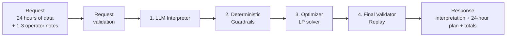
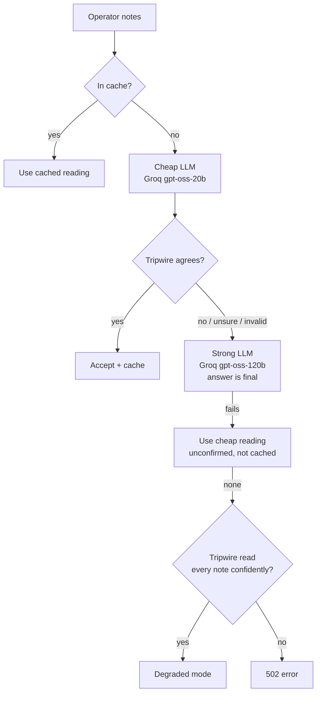

# GridWise

**An LLM-guided 24-hour campus energy planner.** It reads plain-English operator notes, turns them into strict, validated rules, and returns the cheapest grid, solar and battery schedule that obeys all of them.

BUP CSE Fest 2026 · GridWise preliminary.

**Contents:**
[Overview](#overview) ·
[Architecture](#architecture) ·
[Request Processing Flow](#request-processing-flow) ·
[Tech Stack](#tech-stack) ·
[LLM & Model](#llm--model) ·
[Directive Interpretation](#directive-interpretation) ·
[Deterministic Guardrails](#deterministic-guardrails) ·
[Optimization Model](#optimization-model) ·
[Final Validation](#final-validation) ·
[Environment Variables](#environment-variables) ·
[Local Quickstart](#local-quickstart) ·
[API](#api) ·
[Testing](#testing) ·
[Docker Fallback](#docker-fallback) ·
[Error Handling](#error-handling) ·
[Performance Notes](#performance-notes) ·
[Security & Secret Handling](#security--secret-handling) ·
[Known Limitations](#known-limitations) ·
[Dependencies / Credits](#dependencies--credits)

---

## Overview

**Live endpoint**

| | |
|---|---|
| Base URL | `https://gridwise-bup.fly.dev` |
| Health check | `GET https://gridwise-bup.fly.dev/health` → `{"status":"ok"}` |
| Optimizer | `POST https://gridwise-bup.fly.dev/optimize-energy` |
| Repository | <https://github.com/RF-Fahad-Islam/bup-hackathon-preli> |
| Docker image | `docker.io/fahad9767/gridwise:1.0.0` (see [Docker Fallback](#docker-fallback)) |
| Solution video | `<video-link>` *(3 min; script in [docs/VIDEO_GUIDE.md](docs/VIDEO_GUIDE.md))* |

No login, API key or VPN is needed to call the endpoint. It runs on Fly.io with at least one machine always on, so there are no cold starts.

**The challenge.** A campus operator writes 1–3 free-text notes about today's conditions ("solar panels are being washed from noon to 2 PM", "battery charger offline overnight"). GridWise must read those notes correctly, combine them with 24 hours of demand/solar/tariff data and a battery's physical limits, and return the cheapest possible grid/solar/battery schedule that obeys everything — while never letting a language model's mistake produce a wrong or unsafe plan.

**The pipeline**, exactly as the official problem statement frames it:

```
Request → LLM Interpreter → Deterministic Guardrails → Optimizer → Final Validator → Response
```

- **Request**: 24 hours of demand/solar/tariff data, battery limits, and 1–3 operator notes.
- **LLM Interpreter**: reads each note and reports what it literally says (directive type, hours, values).
- **Deterministic Guardrails**: plain code treats the LLM's answer as untrusted, validates it against strict bounds, and does all arithmetic itself.
- **Optimizer**: a linear program finds the proven cheapest schedule subject to every rule.
- **Final Validator**: an independent replay re-checks the finished plan hour by hour and recomputes totals before anything is returned.
- **Response**: interpretation of each note, the 24-hour plan, and cost totals.

---

## Architecture

Think of GridWise as a team of four, where each member has exactly one job.



1. **The Interpreter (an LLM)** reads the notes and says what each one means. It chooses one of six allowed directive types and names the hours and numbers involved — it never does arithmetic.
2. **The Guardrails (plain code, no AI)** treat the LLM's answer as untrusted. They reject anything outside the rules and compute every hour list and factor themselves.
3. **The Optimizer (a math solver)** finds the cheapest schedule. It buys grid power when it is cheap, stores it in the battery, and uses the battery when power is expensive, without ever breaking a rule.
4. **The Final Validator (plain code)** replays the finished plan hour by hour, the way the judge does, and recomputes the totals. A plan that fails this check is never sent.

**Worked example.** The note is *"Expect an 80% reduction in rooftop solar between 11 AM and 2 PM."*

| Step | What happens |
|---|---|
| Interpreter | The LLM reports: type `solar_reduction`, span 11 → 14, value 80, meaning **reduction** |
| Guardrails | The end hour is excluded, so the hours are `[11, 12, 13]`. 80% less means 20% remains, so `factor = 0.2` |
| Optimizer | Solar in hours 11–13 is limited to 20% of the forecast, and the solver finds the cheapest plan |
| Final Validator | Solar used ≤ 20% of forecast in those hours, energy balance holds every hour, and the battery ends where it started |

**Why the LLM doesn't do the arithmetic.** The LLM returns a *raw reading*: what the note literally says, such as span `{start_hour: 11, end_hour: 14}` and `{solar_value: 80, solar_meaning: "reduction"}`. Code then expands the hours and computes the factor. The two classic mistakes — an off-by-one window, and "80% reduction" misread as `0.8` — are structurally valid, so a schema validator alone can't catch them. Removing arithmetic from the LLM's job removes these errors entirely.

**Escalation inside the Interpreter.** Most notes need only one fast, cheap model call. A lightweight pattern-based "tripwire" independently reads the same note; if it disagrees, is unsure, or the LLM's output is invalid, the note is escalated to a stronger model whose answer is final. The tripwire never overrules the LLM by itself — it only decides whether to ask again.



---

## Request Processing Flow

```
POST /optimize-energy
   │
   ├─ 1. Request validation (Pydantic)            400 structural · 422 physically impossible
   ├─ 2. Interpretation (app/interpreter.py, app/llm.py)
   │      one batched LLM call for all notes → one "raw reading" per note
   │      cheap model ─► tripwire check ─agree─► accept · disagree ─► strong model (final)
   ├─ 3. Guardrail (app/directives.py): untrusted LLM output → validated Directive
   ├─ 4. Merge directives per hour: the most restrictive value wins
   ├─ 5. Optimizer (app/optimizer.py): two-stage linear program, 120 variables
   │      infeasible → re-ask strong LLM once → still infeasible → 422
   ├─ 6. Plan building: one battery action per hour, rounded to 4 decimals
   └─ 7. Replay (app/replay.py): independent re-check, totals recomputed from the plan
```

---

## Tech Stack

| Layer | Choice |
|---|---|
| Language | Python 3.11 |
| Web framework | FastAPI + Uvicorn |
| Validation | Pydantic v2 (strict types) |
| LLM, main | **Groq**: `openai/gpt-oss-20b` (first pass) and `openai/gpt-oss-120b` (escalation); `qwen/qwen3.8-27b` as a backup model |
| LLM, fallback | **OpenRouter**: `openai/gpt-4.1-mini` and `google/gemini-2.5-flash` (first pass); `anthropic/claude-sonnet-5` and `anthropic/claude-sonnet-4.6` (escalation) |
| LLM output | Strict JSON schema (`response_format: json_schema`), temperature 0 |
| Optimizer | Linear programming, SciPy `linprog` with the **HiGHS** solver |
| HTTP client | httpx (async) |
| Tests | pytest |
| Container / hosting | Docker (python:3.11-slim, non-root) · Fly.io (region `sin`) |

---

## LLM & Model

- **Providers, in order:** Groq (main), OpenRouter (fallback); OpenAI is supported as an optional extra provider.
- **Models:** cheap first-pass tier (`gpt-oss-20b`, `qwen3.8-27b`, `gpt-4.1-mini`, `gemini-2.5-flash`) and a strong escalation tier (`gpt-oss-120b`, `claude-sonnet-5`, `claude-sonnet-4.6`). Both tiers are configurable via `LLM_CHEAP_CHAIN` / `LLM_STRONG_CHAIN` without touching code.
- **What the LLM actually does:** for each operator note, it returns exactly one "raw reading" — the directive type it belongs to, the literal time span(s) mentioned, and any literal number/percentage — as strict JSON matching a fixed schema. It does **not** expand hour ranges, does **not** convert percentages to factors, and does **not** decide the final schedule. All of that arithmetic happens afterward, in plain code.
- **Confirming the LLM is genuinely in the interpretation path:** every response's `directive_interpretation` array includes an `explanation` field quoting the model's own reasoning per note, and `tests/test_llm_chain.py` / `eval/` exercise the real provider chain (not a mock) against 42 paraphrased notes with a 42/42 pass rate (see [Testing](#testing)).
- **Output format:** one batched call per request handles all of a request's notes together, returning `{"readings": [...]}` validated against a strict JSON Schema (`additionalProperties: false`, enums for `directive_type`, typed numeric fields).

---

## Directive Interpretation

Each note maps to exactly one of six directive types.

| Directive | Meaning | `structured_adjustment` | `applies` |
|---|---|---|---|
| `solar_reduction` | Less solar is available in some hours | `{"hours": [...], "factor": 0–1}` | `true` |
| `minimum_battery_reserve` | Keep at least this much energy in the battery | `{"hours": [...], "minimum_energy_kwh": n}` | `true` |
| `no_charge_window` | The battery must not charge | `{"hours": [...]}` | `true` |
| `no_discharge_window` | The battery must not discharge | `{"hours": [...]}` | `true` |
| `max_grid_window` | Grid import is capped per hour | `{"hours": [...], "max_grid_kwh": n}` | `true` |
| `no_op` | The note doesn't affect today's plan (a distractor) | `null` | `false` |

**`no_op` handling.** Any note that doesn't clearly restrict today's schedule — a different day, an unrelated announcement, a statement that things will be "normal" — is read as `no_op`, with `applies=false` and no adjustment. It is reported back to the caller but excluded from optimization.

**Time normalization.**

| Rule | Example | Result |
|---|---|---|
| Windows include the start hour and exclude the end hour | "1 PM to 3 PM" | `[13, 14]` |
| 24-hour times | "18:00–21:00" | `[18, 19, 20]` |
| Noon and midnight | "from noon until 2 PM" | `[12, 13]` |
| Overnight windows wrap past midnight | "10 PM to 2 AM" | `[0, 1, 22, 23]` |
| Open-ended windows | "from 8 PM onwards" / "until 6 AM" | `[20..23]` / `[0..5]` |
| Times with minutes round outward | "until 3:30 PM" | includes hour 15 |
| Several periods in one note | "2–4 AM and 1–3 PM" | both ranges merged |

**Solar-factor interpretation.** `factor` is always the share of solar that **remains**, in `[0, 1]`. "drops to 20%", "one-fifth of normal", and "80% reduction" all resolve to `factor = 0.2`. The LLM reports the raw percentage and whether it means "remaining" or "reduction"; code does the `1 − x` conversion when needed, never the model.

**Relative percentage / reserve handling.** A reserve given as "% of capacity" (e.g. "keep 50% of capacity") is converted to kWh using the request's actual `capacity_kwh`, in code — not by the model.

**Overlaps.** When two notes affect the same hour, the most restrictive value wins: lowest solar factor, highest reserve, lowest grid cap; no-charge and no-discharge windows are combined (union of hours).

Every `hours` list in the response is unique, sorted and within 0–23. There is exactly one interpretation per note, in the same order as `operator_notes`, identified by `note_index`.

---

## Deterministic Guardrails

The guardrail (`app/directives.py`) never trusts the LLM's output — every field is re-validated in code before it can reach the optimizer:

- `directive_type` must be one of the six allowed values; anything else is rejected.
- Exactly one directive entry per note, matched back to its `note_index`.
- Hours must be within `0–23`, de-duplicated and sorted.
- `solar_reduction` factor is clamped to `[0, 1]`.
- `minimum_battery_reserve` is bounded to `[0, capacity_kwh]`.
- `max_grid_window` amounts must be finite and non-negative.
- `applies` semantics are enforced: `no_op` always has `applies=false` and a `null` adjustment; every other type has `applies=true` with a non-null adjustment.
- Malformed model output (broken JSON, an out-of-schema field, a value outside its bounds) is rejected outright rather than partially accepted — the note is escalated to a stronger model instead of letting bad data through.
- The same schema check runs again on the **outgoing** response, so `structured_adjustment` is verified to match its `directive_type` shape exactly before the API replies (defense-in-depth against a future bug in this layer, not just against the model).

A note that tries to inject instructions ("ignore previous rules…") can at worst produce one of the six bounded directives; it can never change the input data (demand, solar, tariffs, battery limits) or violate a physical rule.

---

## Optimization Model

The whole day is written as a single **linear program** (`app/optimizer.py`), solved with SciPy's `linprog` using the **HiGHS** solver.

- **Objective:** minimize `Σ grid[h] × tariff[h]` over all 24 hours.
- **Energy balance**, for every hour: `grid[h] + solar_used[h] + discharge[h] = demand[h] + charge[h]`.
- **Battery state transition:** `level[h] = level[h-1] + charge[h] − discharge[h]`.
- **Reserve bounds:** `level[h]` stays between the (possibly directive-raised) minimum reserve and `capacity_kwh`.
- **Charge/discharge limits:** `charge[h] ≤ max_charge_kwh_per_hour`, `discharge[h] ≤ max_discharge_kwh_per_hour`.
- **Solar limits:** `solar_used[h] ≤ solar[h]`, further capped by any `solar_reduction` factor for that hour.
- **Directive-specific constraints:** `no_charge_window` forces `charge[h]=0`; `no_discharge_window` forces `discharge[h]=0`; `max_grid_window` caps `grid[h]`.
- **Final battery neutrality:** the battery level after hour 23 must equal its starting level.

There are 5 decision variables per hour (grid, solar used, charge, discharge, battery level) — 120 in total.

**Two-stage solve.** Stage 1 finds the proven minimum cost. Stage 2 re-solves holding that cost fixed, minimizing battery charge+discharge throughput, so the returned plan never charges and discharges in the same hour and ties are broken toward a clean schedule rather than an arbitrary one.

HiGHS was chosen because it returns the *proven* optimal cost in milliseconds and every rule here is a simple linear constraint — no heuristic or approximate solver is needed.

---

## Final Validation

Before any response is returned, `app/replay.py` independently replays the finished plan hour by hour — exactly the way a judge would — and re-derives every number from scratch rather than trusting the solver's own output:

- Energy balance holds in every hour (`grid + solar_used + discharge = demand + charge`).
- Battery level stays within `[reserve, capacity]` at every hour.
- Charge/discharge never exceed their per-hour limits.
- Effective solar used never exceeds the (possibly directive-reduced) forecast.
- Every accepted directive's constraint is actually satisfied in the plan.
- The battery's final level equals its initial level.
- `total_grid_kwh`, `total_cost_bdt` and `peak_grid_kwh` are recomputed from the `hourly_plan`, not carried over from the solver.

If any check fails, the service returns a controlled `500` rather than shipping an invalid plan — this has never been observed in production because the same constraints are enforced by the optimizer, but the check exists as an independent second opinion.

---

## Environment Variables

Only names are listed here. Never commit key values. `.env.example` has the full list.

| Variable | Required | Default | What it does |
|---|---|---|---|
| `GROQ_API_KEY` | **yes** (or an OpenRouter key) | – | Main LLM provider |
| `OPENROUTER_API_KEY` | no | – | Fallback LLM provider |
| `OPENAI_API_KEY` | no | – | Optional extra provider, used only if you add `openai:` to a chain |
| `LLM_CHEAP_CHAIN` | no | `groq:openai/gpt-oss-20b\|qwen/qwen3.8-27b,openrouter:openai/gpt-4.1-mini\|google/gemini-2.5-flash` | First-pass models, tried left to right. Format: `provider:model\|model,provider:model` |
| `LLM_STRONG_CHAIN` | no | `groq:openai/gpt-oss-120b\|openai/gpt-oss-20b,openrouter:anthropic/claude-sonnet-5\|anthropic/claude-sonnet-4.6` | Models used when a reading is escalated |
| `LLM_PROVIDER_COOLDOWN_S` | no | `300` | How long to skip a provider whose key is rejected (401/402/403) |
| `LLM_CHEAP_TIMEOUT_S` | no | `6` | Time limit for the first-pass call |
| `LLM_STRONG_TIMEOUT_S` | no | `10` | Time limit for the escalation call |
| `INTERPRET_DEADLINE_S` | no | `20` | Hard limit for the whole reading step (the judge timeout is 30 s) |
| `INTERPRET_CACHE_SIZE` | no | `1000` | How many confirmed note readings to keep in memory |
| `PORT` | no | `8080` | Listen port |
| `WEB_CONCURRENCY` | no | `2` | Server worker processes in the container |
| `LOG_LEVEL` | no | `INFO` | Each request logs its reading path (`cheap` / `strong` / `cache` / `degraded`), cost and time |

Changing provider or model is a **configuration change, not a code change**.

---

## Local Quickstart

You need **Python 3.11+**, **git** and a **Groq API key** (free at <https://console.groq.com>). An OpenRouter key is optional.

### 1. Clone

```bash
git clone https://github.com/RF-Fahad-Islam/bup-hackathon-preli.git gridwise
cd gridwise
```

### 2. Install

**macOS / Linux**
```bash
python3 -m venv .venv
source .venv/bin/activate
pip install -r requirements.txt
```

**Windows (PowerShell)**
```powershell
python -m venv .venv
.venv\Scripts\Activate.ps1
pip install -r requirements.txt
```

### 3. Configure

**macOS / Linux**
```bash
export GROQ_API_KEY=gsk_your_key_here
# optional fallback: export OPENROUTER_API_KEY=sk-or-your_key_here
```

**Windows (PowerShell)**
```powershell
$env:GROQ_API_KEY="gsk_your_key_here"
# optional fallback: $env:OPENROUTER_API_KEY="sk-or-your_key_here"
```

### 4. Run

```bash
uvicorn app.main:app --host 0.0.0.0 --port 8080
```

The service listens on **port 8080**. In a **second terminal**, in the same folder:

```bash
curl http://127.0.0.1:8080/health
```
Expected: `{"status":"ok"}`

```bash
curl -X POST http://127.0.0.1:8080/optimize-energy -H "Content-Type: application/json" -d @samples/official/requests/SAMPLE-01.json
```
Expected: a JSON response with `directive_interpretation`, a 24-entry `hourly_plan` and `"total_cost_bdt": 38365.0`.

On Windows PowerShell, type `curl.exe` instead of `curl`, and use `127.0.0.1` rather than `localhost`, which avoids a slow IPv6 lookup.

---

## API

### `GET /health`
```bash
curl https://gridwise-bup.fly.dev/health
```
```json
{"status": "ok"}
```

### `POST /optimize-energy`

### Example Request

`samples/official/requests/SAMPLE-01.json`, with the hours shortened here:
```json
{
  "scenario_id": "SAMPLE-01",
  "operator_notes": [
    "Facilities will wash the rooftop solar panels from noon until 2 PM. During cleaning, usable solar should be treated as roughly 25% of the forecast.",
    "The sports office moved next month's registration deadline."
  ],
  "hours": [
    { "hour": 0, "demand_kwh": 90, "solar_kwh": 0, "tariff_bdt_per_kwh": 6 },
    "... exactly 24 entries, hours 0 to 23 ..."
  ],
  "battery": {
    "capacity_kwh": 220, "initial_energy_kwh": 110, "minimum_energy_kwh": 40,
    "max_charge_kwh_per_hour": 50, "max_discharge_kwh_per_hour": 50
  }
}
```

```bash
curl -X POST http://127.0.0.1:8080/optimize-energy \
  -H "Content-Type: application/json" \
  -d @samples/official/requests/SAMPLE-01.json
```

### Example Response

Real output, with `hourly_plan` shortened to hours 11–14:
```json
{
  "scenario_id": "SAMPLE-01",
  "directive_interpretation": [
    {
      "note_index": 0,
      "applies": true,
      "directive_type": "solar_reduction",
      "structured_adjustment": { "hours": [12, 13], "factor": 0.25 },
      "explanation": "Usable solar limited to 0.25x of forecast during 12:00-14:00. Reading: Solar panels are being washed, so available output is about 25% of forecast during that period."
    },
    {
      "note_index": 1,
      "applies": false,
      "directive_type": "no_op",
      "structured_adjustment": null,
      "explanation": "Does not affect today's energy schedule; no constraint applied. Reading: The note refers to a future registration deadline and does not affect today's energy schedule."
    }
  ],
  "hourly_plan": [
    { "hour": 11, "grid_kwh": 0.0,   "solar_used_kwh": 160.0, "battery_action": "discharge", "battery_kwh": 20.0, "battery_energy_after_kwh": 155.0 },
    { "hour": 12, "grid_kwh": 90.0,  "solar_used_kwh": 45.0,  "battery_action": "discharge", "battery_kwh": 50.0, "battery_energy_after_kwh": 105.0 },
    { "hour": 13, "grid_kwh": 152.5, "solar_used_kwh": 42.5,  "battery_action": "charge",    "battery_kwh": 15.0, "battery_energy_after_kwh": 120.0 },
    { "hour": 14, "grid_kwh": 80.0,  "solar_used_kwh": 140.0, "battery_action": "charge",    "battery_kwh": 50.0, "battery_energy_after_kwh": 170.0 }
  ],
  "total_grid_kwh": 2692.5,
  "total_cost_bdt": 38365.0,
  "peak_grid_kwh": 175.0,
  "plan_summary": "Cost-optimal plan (linear program) applying 1 operator directive(s) and ignoring 1 irrelevant note(s). Charges 335.00 kWh during 02:00-05:00, 13:00-16:00, 22:00-00:00. Discharges 335.00 kWh during 01:00-02:00, 10:00-13:00, 17:00-21:00. Grid import 2692.50 kWh (peak 175.00 kWh), cost 38365.00 BDT; battery ends at its starting level."
}
```

**Response fields:**
- `scenario_id` — echoed from the request.
- `directive_interpretation` — one entry per note (`note_index`, `applies`, `directive_type`, `structured_adjustment`, `explanation`), in request order.
- `hourly_plan` — 24 entries (`hour`, `grid_kwh`, `solar_used_kwh`, `battery_action`, `battery_kwh`, `battery_energy_after_kwh`).
- `total_grid_kwh` — sum of grid import over the day.
- `total_cost_bdt` — `Σ grid_kwh[h] × tariff_bdt_per_kwh[h]`, the optimized objective value.
- `peak_grid_kwh` — the highest single-hour grid import.
- `plan_summary` — a deterministic, template-generated human-readable summary (never LLM-written, so it can't contradict the numbers).

What this example shows: "noon until 2 PM" became hours `[12, 13]` because the end hour is excluded; "roughly 25% of the forecast" became `factor 0.25`; the unrelated sports-office note became a distractor (`no_op`); `battery_kwh` is always positive, with direction given by `battery_action`; the cost is exactly the reference optimum.

---

## Testing

### Public Sample Cases

The official pack is `samples/official/public_sample_cases.json`. For direct `curl` use, each request is also saved separately as `samples/official/requests/SAMPLE-01.json` … `SAMPLE-10.json`. This pack is reference material for local testing — it is **not** the hidden judge set.

With the service running:
```bash
python scripts/run_samples.py http://127.0.0.1:8080 samples/official
```

For every sample, the script sends the request to `/optimize-energy` and checks three things:
1. The **interpretation** matches the expected directive type, hours and values.
2. The returned plan passes an **independent replay** of every rule.
3. The **cost** is within 0.01 BDT of the reference optimum (equivalent optimal schedules are accepted, per the official rules).

**Result:** `10/10 samples passed` with Groq, each at the exact reference cost, slowest request 0.84 s. Also verified directly against the live deployment (<https://gridwise-bup.fly.dev>) and against the Docker Hub image running locally — all three environments return identical costs (e.g. SAMPLE-01 → `38365.0` BDT, SAMPLE-02 → `42885.0` BDT).

| Sample | What it tests | Result |
|---|---|---|
| 01 | Solar cleaning + distractor | ✅ |
| 02 | Battery charging maintenance (no-charge) | ✅ |
| 03 | Reserve as % of capacity | ✅ |
| 04 | No-discharge in an expensive period | ✅ |
| 05 | Temporary grid cap | ✅ |
| 06 | Multiple notes + distractor | ✅ |
| 07 | Reserve + grid cap | ✅ |
| 08 | Separate no-charge and no-discharge windows | ✅ |
| 09 | "80% reduction" → factor 0.2 | ✅ |
| 10 | Reserve + grid cap + distractor | ✅ |

### Unit / Integration Tests

```bash
pip install -r requirements-dev.txt
pytest -q          # 89 passed
```

These make no network calls (the LLM is faked) and finish in about 2 seconds.

| Test file | What it proves |
|---|---|
| `tests/test_guardrail.py` | Hour windows, midnight wrap, factor and percentage arithmetic, rejection of invented or out-of-range directives, one entry per note, overlap merging |
| `tests/test_optimizer.py` | Every directive is enforced, and the LP cost **equals an independent brute-force (dynamic programming) optimum** |
| `tests/test_fuzz.py` | 400 random scenarios with random directives, where every plan must pass the replay check |
| `tests/test_api.py` | Response contract, escalation, strong model wins, degraded mode, `502` without a stack trace, `400`/`422`, caching |
| `tests/test_official_samples.py` | All 10 official samples reach the exact reference cost, and the tripwire never contradicts a reference reading |
| `tests/test_tripwire.py` | The tripwire reads common phrasings and stays silent when a note is ambiguous |
| `tests/test_llm_chain.py` | Provider fallback, cool-downs, per-model rate-limit handling |

**Paraphrase robustness (real LLM).** The hidden judge tests re-word notes, so 42 labelled paraphrases cover all six directive types — "one-fifth of normal", "80% reduction" vs "drops to 20%", 24-hour times, noon and midnight, "10 PM to 2 AM", "onwards", % of capacity, "tomorrow" distractors:
```bash
python -m eval.run_eval              # full pipeline
python -m eval.run_eval --pace 20    # wait 20 s between batches (free-tier rate limits)
```
**Result: 42/42 correct.**

---

## Docker Fallback

**Image:** `docker.io/fahad9767/gridwise:1.0.0`
**Digest:** `sha256:6f0ec0a9f020d159dc616dba2ee500727a8276a5e82de709519f159daf2ad932`

### Pull

```bash
docker pull fahad9767/gridwise:1.0.0
```

### Run

```bash
docker run --rm -p 8080:8080 \
  -e GROQ_API_KEY="$GROQ_API_KEY" \
  fahad9767/gridwise:1.0.0
```

- Add the fallback provider with `-e OPENROUTER_API_KEY="$OPENROUTER_API_KEY"`.
- Required env var: `GROQ_API_KEY` (or `OPENROUTER_API_KEY`) — see [Environment Variables](#environment-variables).
- The container binds to `0.0.0.0:8080` (override with `-e PORT=...`), runs as a non-root user, and contains **no baked-in secrets** — keys are passed only at run time.

### Verify /health

```bash
curl http://127.0.0.1:8080/health
# {"status":"ok"}

curl -X POST http://127.0.0.1:8080/optimize-energy -H "Content-Type: application/json" -d @samples/official/requests/SAMPLE-01.json
```

**Verified independently** (pulled fresh, no local build cache): built image is 556 MB, container reports `(healthy)` via its built-in `HEALTHCHECK`, `/health` returns `200 {"status":"ok"}`, and `/optimize-energy` on SAMPLE-01 returns the exact reference cost `total_cost_bdt: 38365.0` — matching both the local build and the live Fly.io deployment.

To build and push the image yourself:
```bash
docker build -t fahad9767/gridwise:1.0.0 .
docker push fahad9767/gridwise:1.0.0
```

The live Fly.io deployment builds from this same [Dockerfile](Dockerfile) remotely (no local Docker required to deploy):
```bash
fly apps create gridwise-bup
fly secrets set GROQ_API_KEY=gsk_... OPENROUTER_API_KEY=sk-or-... --app gridwise-bup
fly deploy --app gridwise-bup
```

---

## Error Handling

| Status | When |
|---|---|
| 200 | Success |
| 400 | Broken JSON, missing or wrong-typed fields, not exactly 24 unique hours 0–23, 0 or more than 3 notes, blank note |
| 422 | Valid JSON that is physically impossible (for example, the starting level is outside the battery limits), or no plan can satisfy the notes even after a second reading |
| 502 | The language model is unavailable and the notes couldn't be read safely |
| 500 | Controlled internal error (e.g. the final replay rejects a plan) |

Error bodies look like `{"error": "<code>", "message": "<safe text>"}` — no stack traces, file paths or configuration are ever exposed. Hours sent out of order are sorted, and unknown extra fields are ignored.

| Failure scenario | What GridWise does |
|---|---|
| Malformed JSON / invalid request structure | Pydantic rejects it with `400` before any LLM call |
| Physically impossible scenario | Rejected with `422` before any LLM call |
| Cheap model misreads a note | The tripwire disagrees, so the note escalates to the strong model, whose answer is final |
| LLM returns invalid output (unknown type, bad hours, reserve > capacity, broken JSON) | The guardrail rejects it and the note escalates; invalid output never reaches the optimizer |
| A model is rate-limited (429) | Only that model is skipped, for its `Retry-After` time (at most 30 s); the next model in the chain is tried |
| A provider rejects the key (401/402/403) or is down | The whole provider is skipped for 5 minutes, and the next provider is used |
| Every LLM is unavailable | **Degraded mode:** the tripwire's own reading is used only if it read *every* note confidently; otherwise `502` rather than guessing |
| The notes lead to an impossible plan | The cached reading is dropped, the strong model re-reads the notes with feedback, and if still impossible the service returns `422` |
| The plan fails the final replay | A controlled `500`; a wrong plan is never sent |
| Any unexpected exception | A safe JSON `500` with no stack trace |
| Container health | Docker `HEALTHCHECK` and Fly.io health checks on `/health`; Fly keeps at least one machine running |

---

## Performance Notes

| Measure | Result |
|---|---|
| Optimizer + replay (no LLM) | about **2 ms** per request (median 1.8 ms, max 3.4 ms over 50 runs) |
| Full request, public samples, Groq, empty cache | **under 1 s** (slowest 0.84 s) |
| Full request, notes already in the cache | a few milliseconds, with no LLM call |
| Worst case (cheap → strong → re-ask) | bounded by the 20 s interpretation deadline, below the judge's 30 s timeout |

Why it's fast: all notes in a request are read in **one** batched LLM call; most requests need only the fast first-pass model; the LP has just 120 variables; confirmed readings are cached; the service runs two worker processes and stays always-warm on Fly.io.

---

## Security & Secret Handling

- **Secrets:** the only secrets are the provider API keys. They are read from environment variables, never logged, and never returned in a response.
- `.env` is git-ignored and docker-ignored; `.env.example` lists variable names only.
- **The repository and the Docker image contain no credentials.** On Fly.io, keys are stored with `fly secrets`; locally/in Docker they are passed only at run time.
- **LLM output is untrusted by design:** the model must answer in a strict JSON schema, every field is validated again in code, it can only choose one of six directive types with bounded values, and it can never change demand, solar forecasts, tariffs or battery limits (see [Deterministic Guardrails](#deterministic-guardrails)).
- **API responses never expose stack traces, file paths, configuration or tokens** — error bodies are a fixed `{"error", "message"}` shape, and the interactive `/docs` page is disabled.
- **Container:** a slim base image, running as a non-root user, with pinned dependency versions.

---

## Known Limitations

- **Rate limits.** Groq's free tier allows about 8,000 tokens per minute per model, roughly 3–4 new interpretations per minute. Under heavy load the chain moves to the next model or to OpenRouter, and repeated notes are served from the cache.
- **External LLM dependency.** The service requires at least one valid provider API key (`GROQ_API_KEY` or `OPENROUTER_API_KEY`) and network access to that provider; if every configured provider is unavailable, the service falls back to degraded mode or returns `502`.
- **Only the six official directive types are supported** (`solar_reduction`, `minimum_battery_reserve`, `no_charge_window`, `no_discharge_window`, `max_grid_window`, `no_op`).
- **Intended for 24-hour challenge scenarios only** — exactly 24 hourly entries, 1–3 operator notes.
- **No grid export.** The model only handles grid import; selling surplus back to the grid isn't part of the problem or this solution.
- **Cache.** The interpretation cache lives in memory per worker process; it is cleared on restart and isn't shared between workers.
- **Ambiguous notes.** A note that could honestly mean two things is decided by the strong model.
- **Times with minutes** round outward to whole hours; **overnight windows** wrap within the same 24-hour day; **overlapping solar reductions** take the lowest factor (factors are not multiplied).

---

## Dependencies / Credits

| Package | Version | Used for |
|---|---|---|
| [FastAPI](https://fastapi.tiangolo.com) | 0.115.6 | HTTP API |
| [Uvicorn](https://www.uvicorn.org) | 0.34.0 | ASGI server |
| [Pydantic](https://docs.pydantic.dev) | 2.10.4 | Request/response validation |
| [SciPy](https://scipy.org) ([HiGHS](https://highs.dev) solver) | 1.14.1 | Linear-program optimizer |
| [NumPy](https://numpy.org) | 2.2.1 | Matrices for the LP |
| [httpx](https://www.python-httpx.org) | 0.28.1 | Async calls to LLM providers |
| [pytest](https://pytest.org) | 8.3.4 | Tests (development only) |

**External services and tools:**
- **Groq**, running OpenAI `gpt-oss-20b` / `gpt-oss-120b` and Qwen.
- **OpenRouter**, running OpenAI GPT-4.1 mini, Google Gemini 2.5 Flash, and Anthropic Claude Sonnet.
- **Docker, Docker Hub** and **Fly.io**.
- The AI coding assistant **Claude Code** was used during development. The architecture and design decisions are the team's own.

All versions are pinned in `requirements.txt` and `requirements-dev.txt`. Domain terms are defined in [CONTEXT.md](CONTEXT.md); the main design decision is recorded in [docs/adr/0001](docs/adr/0001-llm-reads-code-computes-with-tripwire-escalation.md).
